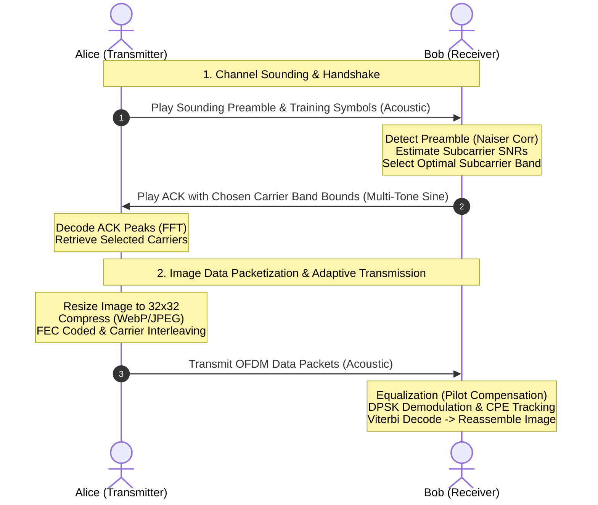

# Acoustic and Optical Communication Flow Analysis

This document provides a detailed breakdown of the acoustic and optical communication protocols and flows implemented in the OceanRealDemo codebase.

---

## 1. Acoustic OFDM Communication Flow

The acoustic communication implementation uses **Orthogonal Frequency Division Multiplexing (OFDM)** modulated via **Binary Phase-Shift Keying (BPSK)** with dynamic channel state estimation and closed-loop frequency adaptation.

### High-Level Architecture & Protocol Sequence



---

### Detailed Phase Breakdown

#### A. Channel Sounding (Alice)
1. **Preamble & Training Generation**: Alice generates a sounding signal consisting of:
   * A synchronization preamble (`naiser` autocorrelation sequence) generated in [PreambleGen.java](file:///home/user/Research_Codes/watercomms/smartphone/OceanRealDemo/app/src/main/java/com/example/root/ffttest2/PreambleGen.java#L5).
   * A known PN sequence (`pn60_bits`) mapped onto default subcarriers to serve as training symbols in [SymbolGeneration.java](file:///home/user/Research_Codes/watercomms/smartphone/OceanRealDemo/app/src/main/java/com/example/root/ffttest2/SymbolGeneration.java#L11).
2. **Audio Playback**: The combined sequence is played using the phone's speaker via the [AudioSpeaker](file:///home/user/Research_Codes/watercomms/smartphone/OceanRealDemo/app/src/main/java/com/example/root/ffttest2/AudioSpeaker.java) class at a sampling rate of 48 kHz.

#### B. Channel Estimation & Carrier Selection (Bob)
1. **Real-time Recording & Detection**: Bob listens for the sounding signal using [OfflineRecorder](file:///home/user/Research_Codes/watercomms/smartphone/OceanRealDemo/app/src/main/java/com/example/root/ffttest2/OfflineRecorder.java). In [Utils.java:waitForChirp](file:///home/user/Research_Codes/watercomms/smartphone/OceanRealDemo/app/src/main/java/com/example/root/ffttest2/Utils.java#L853), Bob uses a sliding-window cross-correlation combined with the Naiser autocorrelation algorithm in [Naiser.java](file:///home/user/Research_Codes/watercomms/smartphone/OceanRealDemo/app/src/main/java/com/example/root/ffttest2/Naiser.java#L76) to find the precise arrival sample of the preamble.
2. **Subcarrier SNR Computation**: Once synchronized, Bob extracts the training symbols and estimates the SNR for each subcarrier frequency in [SNR_freq.java](file:///home/user/Research_Codes/watercomms/smartphone/OceanRealDemo/app/src/main/java/com/example/root/ffttest2/SNR_freq.java#L4) by comparing the estimated signal level against the noise variance.
3. **Frequency Band Adaptation**: Bob selects the optimal contiguous frequency subcarriers via [Fre_adaptation.java](file:///home/user/Research_Codes/watercomms/smartphone/OceanRealDemo/app/src/main/java/com/example/root/ffttest2/Fre_adaptation.java#L13). 
   * It prioritizes blocks of at least 20 subcarriers that meet the minimum SNR threshold.
   * It scales the target threshold dynamically by incorporating energy-concentration gains (`incre` factor) when transmitting over fewer subcarriers.

#### C. Feedback Handshake (Bob $\rightarrow$ Alice)
1. **Multi-Tone ACK Generation**: Bob maps the start and end frequencies of his selected subcarrier band into two sine wave tones in [FeedbackSignal.java:encodeFeedbackSignal](file:///home/user/Research_Codes/watercomms/smartphone/OceanRealDemo/app/src/main/java/com/example/root/ffttest2/FeedbackSignal.java#L74).
2. **Playback**: Bob transmits this dual-tone ACK signal back to Alice.
3. **ACK Decoding**: Alice receives the feedback signal, computes its FFT, and detects the two loudest peaks in [FeedbackSignal.java:decodeFeedbackSignal](file:///home/user/Research_Codes/watercomms/smartphone/OceanRealDemo/app/src/main/java/com/example/root/ffttest2/FeedbackSignal.java#L195) to recover Bob's selected subcarrier bounds.

#### D. Data Transmission (Alice $\rightarrow$ Bob)
1. **Image Compression**: Alice resizes the selected bitmap to a 32x32 bounding box and compresses it using WebP or JPEG at a quality of 10 in [ImagePacketizer.java](file:///home/user/Research_Codes/watercomms/smartphone/OceanRealDemo/app/src/main/java/com/example/root/ffttest2/transport/ImagePacketizer.java#L20).
2. **Packetization**: The compressed stream is split into packets of 128 bytes with a 9-byte transport header in [ImagePacket.java](file:///home/user/Research_Codes/watercomms/smartphone/OceanRealDemo/app/src/main/java/com/example/root/ffttest2/transport/ImagePacket.java#L35).
3. **Forward Error Correction (FEC)**: Packets are encoded with a Viterbi convolutional coder in [Utils.java:encode](file:///home/user/Research_Codes/watercomms/smartphone/OceanRealDemo/app/src/main/java/com/example/root/ffttest2/Utils.java#L1233).
4. **OFDM Modulation & Carrier Interleaving**:
   * Coded bits are mapped onto BPSK symbols.
   * Subcarriers are interleaved (shuffled) in [SymbolGeneration.java:shuffleArray](file:///home/user/Research_Codes/watercomms/smartphone/OceanRealDemo/app/src/main/java/com/example/root/ffttest2/SymbolGeneration.java#L239) to protect against frequency-selective fading.
   * Modulated subcarriers are converted to time-domain samples via Inverse Fast Fourier Transform (IFFT) JNI calls in [SymbolGeneration.java:mod](file:///home/user/Research_Codes/watercomms/smartphone/OceanRealDemo/app/src/main/java/com/example/root/ffttest2/SymbolGeneration.java#L284).
   * A cyclic prefix (67 samples) and pilot subcarriers (spaced every 5 carriers) are inserted.
5. **Acoustic Playback**: Alice plays the modulated data packets acoustically.

#### E. Data Demodulation & Reassembly (Bob)
1. **Equalization & Demodulation**: Bob synchronizes to each packet, performs FFT, extracts the pilot tones, and calculates equalization weights in [Decoder.java](file:///home/user/Research_Codes/watercomms/smartphone/OceanRealDemo/app/src/main/java/com/example/root/ffttest2/Decoder.java#L26).
2. **Common Phase Error (CPE) Correction**: The phase drift is tracked and corrected continuously using the pilot subcarriers in [Modulation.java:pskdemod_differential](file:///home/user/Research_Codes/watercomms/smartphone/OceanRealDemo/app/src/main/java/com/example/root/ffttest2/Modulation.java#L54).
3. **Bit Recovery**: Subcarriers are unshuffled, and the Viterbi decoder in [Utils.java:decode](file:///home/user/Research_Codes/watercomms/smartphone/OceanRealDemo/app/src/main/java/com/example/root/ffttest2/Utils.java#L1232) reconstructs the original packet payload.
4. **Resilient Reassembly**: The packets are sent to [ImageAssembler.java](file:///home/user/Research_Codes/watercomms/smartphone/OceanRealDemo/app/src/main/java/com/example/root/ffttest2/transport/ImageAssembler.java#L38). If missing gaps exist, it zero-fills them to show a live partial preview of the image. When all packets arrive, the full image is reconstructed.

---

## 2. Optical Communication Flow

The optical communication method transmits data using On-Off Keying (OOK) via the phone's camera flashlight, captured and decoded in real-time by the receiver's camera.

```mermaid
graph TD
    subgraph Transmitter (Alice)
        A[Image Packet Bytes] --> B[4B5B Encoding]
        B --> C[Transmit HIGH Preamble 800ms]
        C --> D[Transmit Guard Interval 200ms]
        D --> E[OOK Flashlight Blinking 5 Hz]
        E --> F[Transmit LOW STOP Signal 900ms]
    end

    subgraph Receiver (Bob)
        G[Camera YUV Frame Capture] --> H[Center 40% ROI Luminance Extraction]
        H --> I[Adaptive Sliding Thresholding]
        I --> J[Edge-List Decoding & Timestamp Log]
        J --> K[Clock Recovery & Bit Resampling]
        K --> L[Phase Shift & Polarity Recovery]
        L --> M[4B5B Decoding & Magic Word Alignment]
        M --> N[Image Assembler Reassembly]
    end
```

---

### Detailed Phase Breakdown

#### A. Physical Transmission (Alice)
1. **4B5B Encoding**: To prevent synchronization loss from long strings of zeros, Alice splits each byte into two 4-bit nibbles and maps them to 5-bit codewords using the 100BASE-TX mapping table in [FourB5B.java](file:///home/user/Research_Codes/watercomms/smartphone/OceanRealDemo/app/src/main/java/com/example/root/ffttest2/optical/FourB5B.java#L31).
2. **Preamble and Guard**: The flashlight controller in [FlashlightController.java](file:///home/user/Research_Codes/watercomms/smartphone/OceanRealDemo/app/src/main/java/com/example/root/ffttest2/optical/FlashlightController.java#L35) sets the flashlight HIGH for 800ms to stabilize the receiver threshold, followed by a 200ms LOW guard interval.
3. **Blinking Duration**: The 10-bit encoded data is transmitted bit by bit at 5 Hz (`BIT_DURATION_MS = 200` ms).
4. **STOP Signal**: Alice completes the transmission with a LOW signal for at least 900ms.

#### B. Camera Frame Capture & Dynamic Thresholding (Bob)
1. **Luminance Extraction**: Bob registers a CameraX analyzer in [DashboardActivity.java](file:///home/user/Research_Codes/watercomms/smartphone/OceanRealDemo/app/src/main/java/com/example/root/ffttest2/DashboardActivity.java#L581). For each frame, it extracts the Y luminance channel from the center 40% ROI in [OpticalDetector.java:calculateROIIntensity](file:///home/user/Research_Codes/watercomms/smartphone/OceanRealDemo/app/src/main/java/com/example/root/ffttest2/optical/OpticalDetector.java#L138).
2. **Dynamic Sliding Threshold**: An intensity history window of 150 frames is maintained. If the difference between the minimum and maximum luminance in the window is $> 12$, the decision threshold is updated to `(min + max) / 2.0` in [OpticalDetector.java:updateThreshold](file:///home/user/Research_Codes/watercomms/smartphone/OceanRealDemo/app/src/main/java/com/example/root/ffttest2/optical/OpticalDetector.java#L160). This dynamically adapts to changing ambient light conditions.

#### C. Edge Logging & Clock Recovery (Bob)
1. **Preamble Sync**: Bob compares the intensity to the dynamic threshold. If a transition from HIGH to LOW occurs after a HIGH duration of $\ge 600$ ms, it transitions from `IDLE` to `RECEIVING`.
2. **Edge-List Logging**: During reception, the high-precision timestamps (ms) of all level changes (edges) are recorded in [OpticalDetector.java:processSample](file:///home/user/Research_Codes/watercomms/smartphone/OceanRealDemo/app/src/main/java/com/example/root/ffttest2/optical/OpticalDetector.java#L178).
3. **STOP Detection**: If the level remains LOW for $\ge 800$ ms, the receiver halts logging and triggers the edge-decoding stage.
4. **Clock Drift Recovery**: Between each recorded transition, Bob calculates the number of bits sent by rounding the duration against the bit duration: `round(duration / 200)`. This allows robust recovery even if the camera frame rate fluctuates.

#### D. Alignment & Decoding (Bob)
1. **Shift and Polarity Scan**: Due to varying lighting environments, polarization, or packet boundary offsets, the bitstream could be inverted or shifted. Bob searches through both the normal and inverted bitstreams across all 10 possible bit-level shifts in [OpticalDetector.java:processBitstream](file:///home/user/Research_Codes/watercomms/smartphone/OceanRealDemo/app/src/main/java/com/example/root/ffttest2/optical/OpticalDetector.java#L273).
2. **Codeword Validation**: Bob decodes the symbols using [FourB5B.decode](file:///home/user/Research_Codes/watercomms/smartphone/OceanRealDemo/app/src/main/java/com/example/root/ffttest2/optical/FourB5B.java#L41) and selects the shift/polarity combination that maximizes the number of valid 4B5B codewords.
3. **Magic Word Check**: The byte stream is accumulated into a bitstream buffer. Once the magic word `'OR'` (`"0100111101010010"`) is detected, the receiver extracts the subsequent packet bits and decodes the `ImagePacket`.
4. **Image Reassembly**: Valid packets are pushed to [ImageAssembler](file:///home/user/Research_Codes/watercomms/smartphone/OceanRealDemo/app/src/main/java/com/example/root/ffttest2/transport/ImageAssembler.java#L38) to reconstruct the original image.

---

## 3. Communication System Parameters Comparison

| Parameter | Acoustic (OFDM) | Optical (OOK) |
|---|---|---|
| **Carrier/Physical Layer** | Acoustic subcarriers (sound wave) | Smartphone Flashlight LED (light) |
| **Bandwidth/Frequency Range** | 1 kHz - 4 kHz (adjustable up to 8 kHz) | 5 Hz blinking frequency |
| **Channel Adaptation** | Dynamic SNR & contiguous subcarrier band estimation | Adaptive sliding threshold based on ambient light |
| **Sync Method** | Cross-correlation + Naiser Autocorrelation | Edge duration analysis ($\ge 600$ms preamble HIGH) |
| **Error Control / Coding** | Common Phase Error pilots + Viterbi FEC | 4B5B code constraint (max 3 consecutive zeros) |
| **Typical Payload Size** | 128 bytes | 32 bytes |
| **Primary Receiver Hardware** | Microphone | Camera |
| **Reassembly Pipeline** | [ImageAssembler](file:///home/user/Research_Codes/watercomms/smartphone/OceanRealDemo/app/src/main/java/com/example/root/ffttest2/transport/ImageAssembler.java) | [ImageAssembler](file:///home/user/Research_Codes/watercomms/smartphone/OceanRealDemo/app/src/main/java/com/example/root/ffttest2/transport/ImageAssembler.java) |
